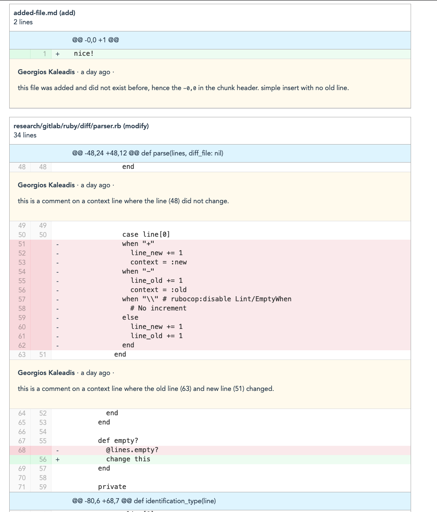

# Vue 3 + Typescript + Vite
Compare the [PR](https://github.com/satellytes/diffy/pull/1/files) with the source data with the following vue component after the data (diff & comments) is fetched, parsed and rendered 🙌

## How I imagine the future
Start slowly, grow steadily, code doesn't need to be perfect.
I would like to be able to store diffs, comments, pull request descriptions and ideally some technical question catalogues.
From that I would like to build a tool that lists all available pull_request temmplates and questions. I can then curate a 
"review challenge" for an applicant. The applicant won't be able to see the comments but can author comments.

On the other side we would be able to view the master solution (reading the prepared PRs) and compare them with the given PR comments.
That way we can see what common places have been commented and if not what things would we like to bring into the interview where we want to talk about it.

The interview itself should be based on a "review package" that we can use to prepare an interview or even bring some printed stuff so go over
the given comments but als highlight some other issues not found by the applicant. As a bonus we get some addition interview questions
to use during the interview.

Ideally it's a web platform where we can login with our specific role and let the applicant login with an applicant role to author the challenge feedback
while the mastery comments from us are not exposed.

This is now based on Vue, so Next.js won't be the best option I guess? Mayeb something purely driven by API
or maybe going back to Ruby on Rails my love from yeears ago (gitlab and github are both based on RoR by the way)

Other ideas are welcome.

## Goal 1: Display Diff & Comment
That experiment contains a vue 3 installationn which can process a github PR (diff + PR)
to display the content in a single column view (split is next).

The experiment includes a parser with a custom data format mostly inspired by the way gitlab outputs their merge requests. We will parse diff + comments into a diff > lines hierarchy where each line is either a hunk header or a code line. A code line can come with a comment. The comment itself can refer to multiple lines but the anchoring line is always the bottom line of a range.

The view works really good. The next steps:
Include a storage system like vuex (to gain some experience with it) and to pave the way for comment editing/addition and also hosting a server-backed version.

The first goal to display diff & comments is complete and the structure understandable (if you get warm with the diff format at least) ✅🙌

## Goal 2: Display Editor and store new comments
This will require a store, hydration (to pick up the existing comments) and the actual form (ideally markdown). 
That way we can proof that we can insert/author comments. 

gitlab (based on vue) created their own editor. either we pick some out of the box markdown editor
or we just stick to plain text or manual markdown (with a preview rendered through some markdown library)

---
From here we can later continue with roles to either display the comments or not.
There are also other ideas we could check out: Include questions, start working on the "review challenge" data model and displaying through some routing logic (overview, list, details, show difss, hide/show comments etc). 
